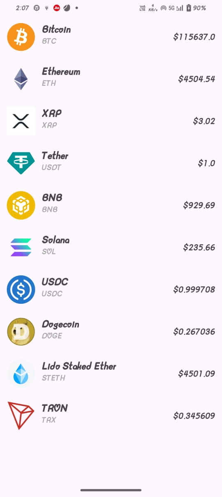

# 📊 CryptoTracker

A simple cryptocurrency tracker app that shows the name, current price, and description of the Top 10 Cryptocurrencies.

# 📌 Features

Fetches live data for the top 10 cryptocurrencies.

Displays:

🪙 Name

💰 Current Price (USD)

# 📖 Description

Uses MVVM architecture with Repository pattern.

Built with Kotlin, Retrofit, Coroutines, LiveData/Flow, RecyclerView.

# 🛠️ Tech Stack

Language: Kotlin

Architecture: MVVM (Model–View–ViewModel)

Networking: Retrofit + Gson + OkHttp

Async: Coroutines (suspend functions)

UI: RecyclerView, Material Components

# 🌐 API Used

We use CoinGecko API (free, no API key required).

## Endpoint:

GET https://api.coingecko.com/api/v3/coins/markets
?vs_currency=usd
&order=market_cap_desc
&per_page=10
&page=1
&sparkline=false

## Sample Fields Used:

[
  {
    "id": "bitcoin",
    "name": "Bitcoin",
    "current_price": 27000,
    "description": "Bitcoin is a decentralized digital currency..."
  }
]

# screenshots

# TOP 10 CRYPTO COINS

# 📂 Project Structure

app/

 └─ src/main/java/com/example/cryptotracker/
 
    ├─ data/
    │   ├─ api/ApiService.kt
    │   └─ model/Crypto.kt
    ├─ di/RetrofitInstance.kt
    ├─ repository/CryptoRepository.kt
    ├─ ui/
    │   ├─ CryptoAdapter.kt
    │   ├─ CryptoViewModel.kt
    │   └─ MainActivity.kt

classDiagram

    class ApiService {
        +getTopCoins()
    }

    class RetrofitInstance {
        +api: ApiService
    }

    class CryptoRepository {
        +fetchTopCoins()
    }

    class CryptoViewModel {
        -repository
        +coins : LiveData
        +fetchCoins()
    }

    class MainActivity {
        -adapter
        +observeViewModel()
        +showData()
    }

    class CryptoAdapter {
        -items : List<Crypto>
        +bind(name, price, description)
    }

    class Crypto {
        -name : String
        -currentPrice : Double
        -description : String
    }

    ApiService --> RetrofitInstance
    RetrofitInstance --> CryptoRepository
    CryptoRepository --> CryptoViewModel
    CryptoViewModel --> MainActivity
    MainActivity --> CryptoAdapter
    CryptoAdapter --> Crypto

# NEXT STEPS

Add favorites list.

Add detail screen with charts.

Offline caching with Room.
